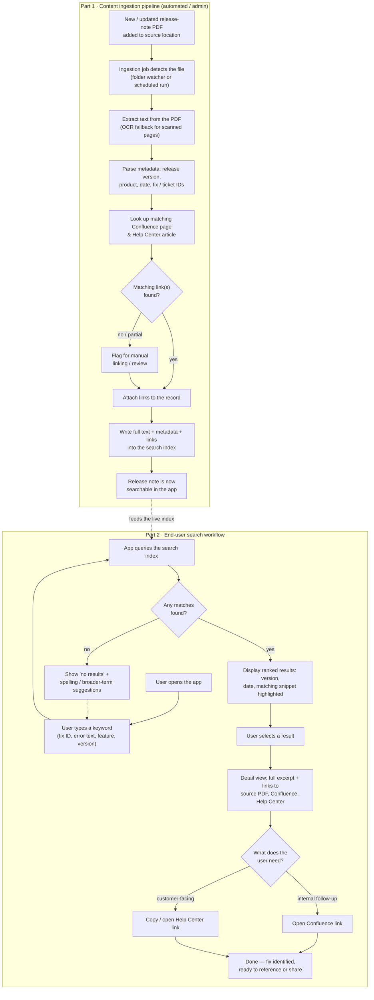

# Workflow

How a keyword search finds the right release note fast, and hands the user a direct link to the internal Confluence page or the external Help Center article — instead of opening PDFs one by one.

The system has two halves: a background ingestion pipeline that indexes release-note PDFs, and the end-user search experience built on top of that index.

A higher-resolution rendered version of this diagram is in [`docs/assets/workflow-diagram.svg`](assets/workflow-diagram.svg).

## Part 1 — Content ingestion pipeline

Runs in the background with no user involvement, implemented today as [`ingestion/ingest.py`](../ingestion/ingest.py):

1. **Detect** — the script scans a source folder for `.pdf` files (currently run by hand or on a schedule; a real folder-watcher/cron job is a later step — see [decisions](decisions.md)).
2. **Extract text** — [pypdf](https://pypi.org/project/pypdf/) pulls text out of each PDF.
3. **Parse metadata** — regexes pull a release version, a date, and any fix/ticket IDs (e.g. `FIX-1042`, `JIRA-2291`) out of the extracted text, falling back to the filename for the product/version if nothing was found in the body.
4. **Match links** — the parsed version is looked up against a manual CSV mapping ([`ingestion/config/links.csv`](../ingestion/config/links.csv)) to attach a Confluence URL and a Help Center URL. Anything that doesn't match is indexed anyway, just without links — visible in search results as "no linked resources yet" rather than silently dropped.
5. **Index** — the text, metadata, and links get written into a SQLite [FTS5](https://www.sqlite.org/fts5.html) full-text-search table (`data/release_notes.db`), which the app queries at search time.

## Part 2 — End-user search workflow

What the person searching actually sees, implemented today as [`app/main.py`](../app/main.py) + [`app/templates/index.html`](../app/templates/index.html):

1. User opens the app and types a keyword — a fix ID, an error string, a feature name, or a version number.
2. Each keystroke (debounced) hits `/api/search`, which runs a `MATCH` query against the FTS5 index and ranks results by [BM25](https://www.sqlite.org/fts5.html#the_bm25_function) relevance.
3. Results show the product, version, release date, and a snippet with the matched term highlighted.
4. Selecting a result reveals the source PDF link, the Confluence link (if matched), and the Help Center link (if matched) — so the person can either dig into internal context or hand a customer the public article directly.

## Current implementation vs. the target design

The `ingestion/` and `app/` code in this repo is a working prototype of the diagram above, built to prove out the mechanics end to end — not the production system. See [`docs/decisions.md`](decisions.md) for what's simplified and what a larger-scale implementation would need to change.
